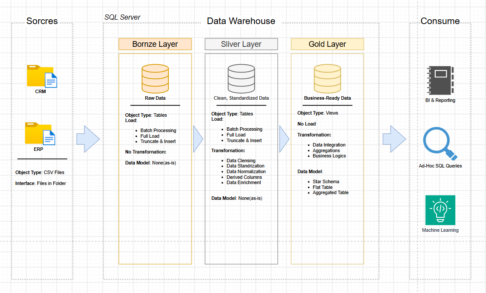

# Data Warehouse and Analytics Project

---
## 🏗️ Data Architecture

The data architecture for this project follows Medallion Architecture **Bronze**, **Silver**, and **Gold** layers:


1. **Bronze Layer**: Stores raw data as-is from the source systems. Data is ingested from CSV Files into SQL Server Database.
2. **Silver Layer**: This layer includes data cleansing, standardization, and normalization processes to prepare data for analysis.
3. **Gold Layer**: Houses business-ready data modeled into a star schema required for reporting and analytics.

Technology Stack
1. Databricks – Data engineering platform and processing environment.
2. PySpark – ETL, data transformation, and data cleansing.
3. SQL – Data analysis and analytical queries.
4. Delta Lake – Storage format for the Bronze, Silver, and Gold layers.
5. Git / GitHub – Version control and project management.
6. Draw.io – Data architecture and data modeling diagrams.

---
## 📖 Project Overview

This project involves:

1. **Data Architecture**: Designing a Modern Data Warehouse Using Medallion Architecture **Bronze**, **Silver**, and **Gold** layers.
2. **ETL Pipelines**: Extracting, transforming, and loading data from source systems into the warehouse.
3. **Data Modeling**: Developing fact and dimension tables optimized for analytical queries.
4. **Analytics & Reporting**: Creating SQL-based reports and dashboards for actionable insights.

🎯 This repository demonstrates practical experience in:
- Databricks
- PySpark
- SQL
- Data Engineering
- ETL / ELT Pipelines
- Medallion Architecture
- Delta Lake
- Data Modeling
- Data Warehousing
- Data Quality
- Data Analytics 

---

## 🛠️ Important Links & Tools:

- **[Datasets](datasets/):** Access to the project dataset (csv files).
- **[Git Repository](https://github.com/):** Set up a GitHub account and repository to manage, version, and collaborate on your code efficiently.
- **[DrawIO](https://www.drawio.com/):** Design data architecture, models, flows, and diagrams.

---

## 🚀 Project Requirements

### Building the Data Warehouse (Data Engineering)

#### Objective
Develop a modern data warehouse using Databricks, PySpark, Delta Lake, and SQL to consolidate ERP and CRM sales data and enable analytical reporting.

#### Specifications
- **Data Sources**: Import data from two source systems (ERP and CRM) provided as CSV files.
- **Data Quality**: Cleanse and resolve data quality issues prior to analysis.
- **Integration**: Combine both sources into a single, user-friendly data model designed for analytical queries.
- **Scope**: Focus on the latest dataset only; historization of data is not required.
- **Documentation**: Provide clear documentation of the data model to support both business stakeholders and analytics teams.

---

### BI: Analytics & Reporting (Data Analysis)

#### Objective
Develop SQL-based analytics to deliver detailed insights into:
- **Customer Behavior**
- **Product Performance**
- **Sales Trends**

These insights empower stakeholders with key business metrics, enabling strategic decision-making.  


## 📂 Repository Structure
```
data-warehouse-project/
│
├── bike_lakehouse_2026/
│   │
│   ├── datasets/                       # Raw ERP and CRM datasets
│   │
│   └── scripts/                        # SQL scripts for ETL and transformations
│       ├── bronze/                     # Scripts for extracting and loading raw data
│       ├── silver/                     # Scripts for cleaning and transforming data
│       └── gold/                       # Scripts for creating analytical models
│
├── docs/                               # Project documentation and architecture details
│   ├── data_architecture.drawio        # Project architecture
│   ├── data_catalog.md                 # Dataset and field descriptions
│   ├── data_flow.drawio                # Data flow diagram
│   ├── data_integration.drawio         # ERP and CRM data integration
│   └── data_models.drawio              # Star schema/data model
│
└── README.md                           # Project overview and instructions
```
---
